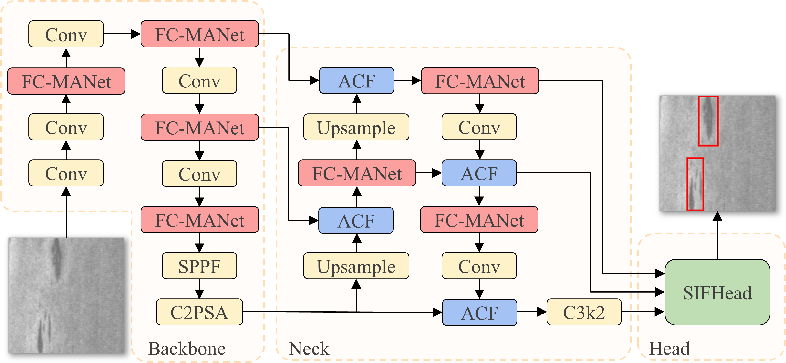
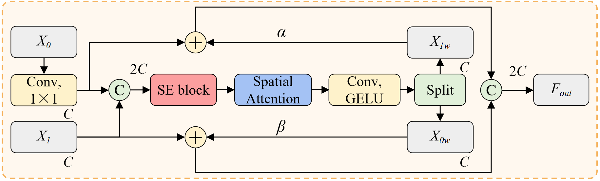
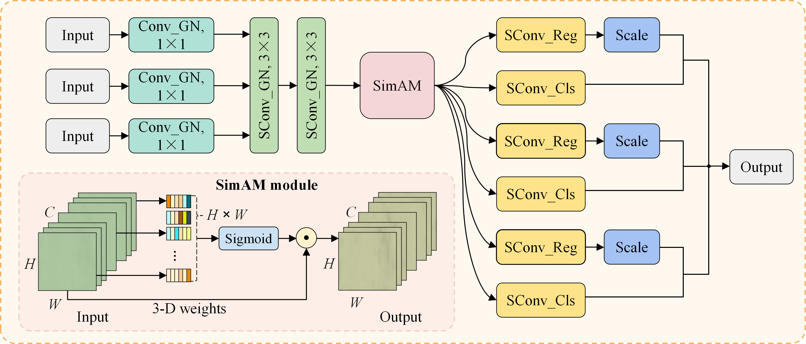
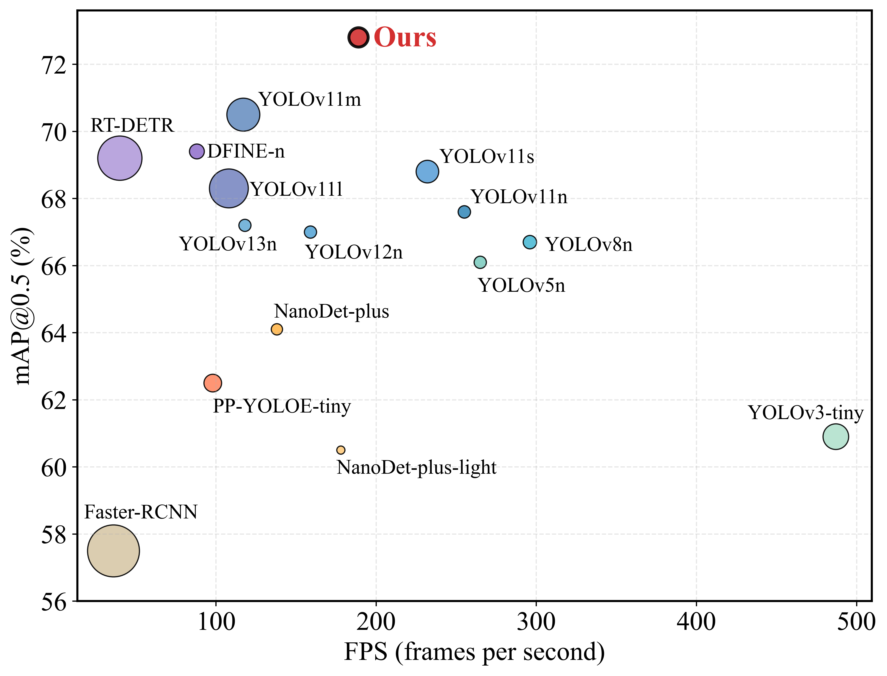

# AGE-YOLO

AGE-YOLO is an **accurate, generalized, and efficient** object detection framework designed for steel surface defect detection under industrial scenarios. It bridges the gap between lightweight design and high-precision performance.

## Overview

Steel surface defect detection plays a critical role in industrial manufacturing for ensuring product quality. However, existing methods often struggle to simultaneously achieve high accuracy, real-time efficiency, and stable generalization across diverse ind[gc10_data.yaml](..%2F..%2F..%2F..%2F..%2F..%2F..%2F..%2FUsers%2FYH%2FDesktop%2Fgc10-ok%2Fgc10_data.yaml)ustrial domains. 

AGE-YOLO addresses these challenges through three synergistic modules:

* **Feature-Context Multi-Aggregation Network (FC-MANet):** Replaces conventional bottleneck structures with **Faster-CGLU and Partial Convolution (PConv)**. It enhances nonlinear representation and adaptive feature selection, specifically targeting unstructured defect patterns while suppressing background noise.
* **Adaptive Cross-scale Fusion (ACF):** Dynamically aligns and integrates multi-level features using **dual spatial–channel guidance and learnable cross-scale compensation**. It ensures structural continuity for elongated defects (e.g., creases) and mitigates scale distribution shifts across datasets.
* **Shared Insight Focus Head (SIFHead):** Employs lightweight **shared convolutions** and **Group Normalization (GN)**. By enforcing scale-invariant encoding, it improves localization stability and sensitivity for small-scale anomalies, even under small-batch industrial constraints.

*Figure 1: The overall architecture of AGE-YOLO.*

### 🧩 Core Modules

| **FC-MANet** | **ACF Module** | **SIFHead** |
| :---: | :---: | :---: |
|  |  |  |
| *Adaptive Feature Selection* | *Cross-scale Fusion* | *Scale-invariant Prediction* |
## Installation

```bash
git clone https://github.com/gnmtdt/AGE-YOLO.git
cd AGE-YOLO
pip install -r requirements.txt
```

## 📂 Dataset Preparation

We provide two ways to acquire the datasets (**GC10-DET**, **NEU-DET**, **HRIPCB**). See [dataset/README.md](dataset/README.md) for detailed processing instructions.

### Option A: Pre-processed YOLO Format (Recommended)
Directly download the split and formatted datasets from our Hugging Face repository:
- [All-in-One Dataset ](https://huggingface.co/datasets/YYYHHHH993/AGE-YOLO)


### Option B: Original Raw Sources
- **GC10-DET**: [Kaggle](https://www.kaggle.com/datasets/alex000kim/gc10det)
- **NEU-DET**: [Roboflow](https://universe.roboflow.com/park-sung-ho/neu-det-object-detection)
- **HRIPCB**: [Kaggle](https://www.kaggle.com/datasets/akhatova/pcb-defects)


<br><br>

> **⚠️ Important:** Before training, please refer to [dataset/README.md](dataset/README.md) for mandatory data augmentation and path configuration instructions.
## Training

Ensure your data is prepared according to the instructions above, then run:

```bash
python train.py
```

## Val or Test

Run the evaluation script directly:
```bash
python test.py --split val
```
or 
```bash
python test.py
```

## Detection

Run inference on sample images located in `assets/samples`:

```bash
python detect.py
```

## Comparison with SOTA Models (GC10-DET)

### mAP vs. Parameters



The following table summarizes the performance on the GC10-DET dataset. All results for mAP@0.5 represent the **mean ± standard deviation** across five independent runs.

| Model | mAP@0.5 (%) | Precision (%) | Recall (%) | Params (M) | FLOPs (G) | FPS |
| :--- | :---: | :---: | :---: | :---: | :---: | :---: |
| Faster R-CNN | 57.5 ± 0.35 | 55.6 | 60.3 | 41.40 | 137.2 | 36 |
| YOLOv3-tiny | 60.9 ± 0.28 | 60.8 | 58.7 | 12.10 | 19.1 | 487 |
| YOLOv5n | 66.1 ± 0.14 | 75.6 | 62.3 | 2.51 | 7.2 | 265 |
| YOLOv8n | 66.7 ± 0.15 | 68.2 | 65.3 | 3.01 | 8.2 | 296 |
| YOLOv11n (Baseline) | 67.6 ± 0.11 | 64.3 | 67.6 | 2.58 | 6.3 | 255 |
| YOLOv12n | 67.0 ± 0.15 | 68.8 | 63.9 | 2.50 | 5.8 | 159 |
| YOLOv13n | 67.2 ± 0.14 | 65.8 | 67.2 | 2.46 | 6.3 | 118 |
| RT-DETR | 69.2 ± 0.28 | 78.8 | 68.1 | 32.80 | 108.0 | 40 |
| **AGE-YOLO (Ours)** | **72.8 ± 0.23** | **72.1** | **68.4** | **3.41** | **7.7** | **189** |

<br>

> **Note:**
> - **Testing Environment:** NVIDIA RTX 4090D (24 GB), batch size = 1, resolution = 640 × 640. 
> - **FPS** denotes end-to-end inference speed (Preprocessing + Forward + NMS).
> - For full class-wise AP and detailed comparisons, please refer to our main paper.